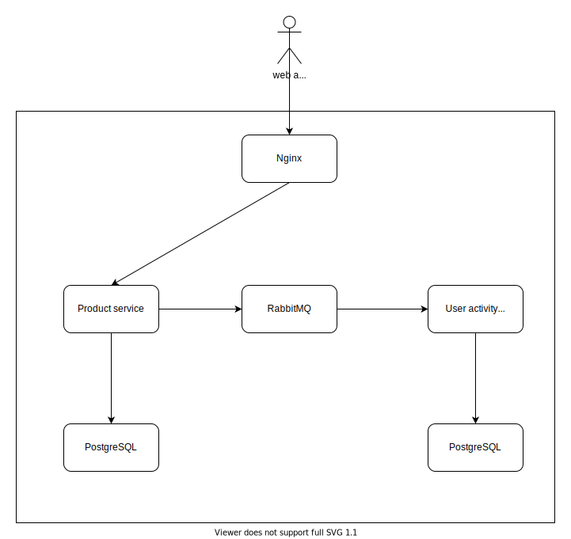
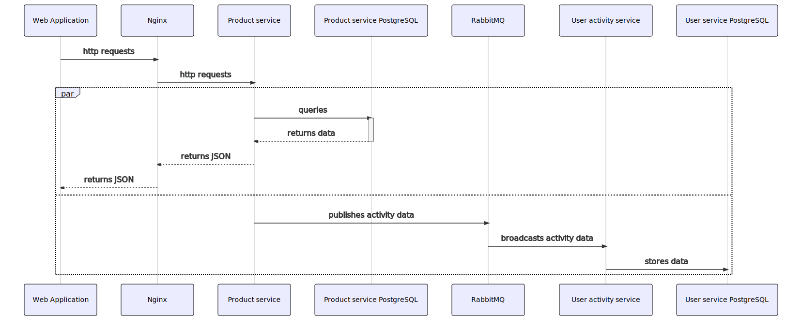

# iCommerce

Backend services for a simple ecommerce website using Node.js

## High-level system architecture diagram



## Sequence diagram for an API request to show list of products



## Entity relatioship diagram for the product service's database


## Software development principles, patterns & practices

### Single resposibility principle

- For each Docker container specified in `docker-compose.yml`, it is responsible for running 1 particular service such as a container to run Product service, 1 container to run RabbitMQ and 1 container to run database.
- For each module/class/function, each of them is responsible for holding the logic for 1 particular task such as `category` model to contains its structure and a data access layer for each domain (product, category) to perform query actions to the database.

### Event-driven pattern

- To communicate with the user activity service from the product service asynchronously without blocking main logic to response data to the web application, event-driven pattern is implemented using RabbitMQ as a message broker.
- Produce services publishes an event containing necessary data to the RabbitMQ, the user activity service listens for events coming from RabbitMQ and finally store the data in its database

### Dependency injection

- With dependency injection, a domain's service/data access layer doesn't have to import other modules and all those depedencies will re injected into the constructor's parameter.
- This design pattern makes it easier to write unit test for the classes above by isolating itself from other modules/classes and the parameters can be mocked.

### Pre-compress API's response data

- Backend service should compress (`gzip` or `brotli` algorithm) the response data prior to sending to the client-side as this will reduce the response time and network bandwitdth consumption.

### Modify HTTP response headers to reduce security risk

- Remove sensitive information such as the current version of Express.js and Nginx
- Append security headers such as `X-Content-Type-Options`, `X-Frame-Options` and `X-XSS-Protection` to prevent common security vulnerabilities

### Logging

- Enable logging for incoming requests and custom logging for errors.
- For development environment, logging as much details as possible to STDOUT makes it easier to test and debug.
- For production environment, logging as much details as possible to STDOUT of Docker container or to log files makes it easier to track, visualize, search and even to set alert using well-known and open-source technology like ELK stack.

### Database per microservice

- In microservice architecture, it is a best practice to setup database for each service and avoid using a same database for multiple microservices.
- To perform actions to other service's database, it is a best practice to that all actions must go to the corresponding backend service first and then go to the database. See `## High-level system architecture diagram` section for visualization

### Auto code linting and formating tools

- To ensure consistent code styling and check code errors, ESLint and Prettier are integrated to support developers with commands to help check and auto-correct code
- Link with Git hook to trigger those commands on changed files prior to `git commit`

### Use environment variable to hold changeable and sensitive data

- Data such as configurations for database access, URLs to 3rd party service or AWS's access/secret key needs to be isolated from the main codebase as it can result in possible sensitive data leak
- Data depending on deployment environment needs to use environment variable to create flexibility and avoid hardcode

## Code folder structure

### product-service

```bash
├── config
│   ├── apollo-graphql.js
│   ├── database.js
│   ├── express.js
│   ├── http-server.js
│   ├── winston-express-error-logger.js
│   └── winston-express-logger.js
```

- `config` contains main configuration of the backend service including apollo graphql, PostgreSQL connection, Express.js and HTTP server, and logging

```bash
├── db
│   ├── migrations
│   │   ├── 20201030101321-create-category.js
│   │   └── 20201030101351-create-product.js
│   ├── models
│   │   ├── category.js
│   │   ├── index.js
│   │   └── product.js
│   └── seeders
│       ├── 20201030115602-sample-categories.js
│       └── 20201030120132-sample-products.js
```

- `db` contains all the database migration history, Sequelize data model to perform queries and seeders to generate sample data.

```bash
├── helpers
│   └── custom-stdout-logging.js
```

- `helpers` contains functions to be used system-wide containing functiont to write custom log to STDOUT

```bash
├── src
│   ├── app
│   │   ├── category
│   │   │   ├── __tests__
│   │   │   │   ├── category-db.test.js
│   │   │   │   └── category-service.test.js
│   │   │   ├── category-db.js
│   │   │   ├── category-ioc-container.js
│   │   │   ├── category-nested-resolvers.js
│   │   │   ├── category-service.js
│   │   │   └── graphql
│   │   │       └── category-type.js
│   │   └── product
│   │       ├── __tests__
│   │       │   ├── product-db.test.js
│   │       │   └── product-service.test.js
│   │       ├── constants.js
│   │       ├── graphql
│   │       │   ├── product-enums.js
│   │       │   ├── product-query-schema.js
│   │       │   └── product-type.js
│   │       ├── product-db.js
│   │       ├── product-ioc-container.js
│   │       ├── product-resolvers.js
│   │       └── product-service.js
```

- `src/app` contains core business model's logic. For each product and category, there's a service to execute business logic and a DAL to perform queries to the database via the models specified in `db`.
- It contains the GraphQL specs of each domain including query schema, type schema and enums.
- `__tests__` folders contains corresponding unit test cases

```bash
├── src
│   └── graphql
│       ├── __tests__
│       │   └── graphql-schema.test.js
│       ├── query-schema.js
│       ├── resolvers.js
│       ├── shared
│       │   └── datetime-type.js
│       ├── type-defs.js
│       └── types.js
```

- This is the directory combining all the Apollo GraphQL specs across the service including query schema, types, enums and resolvers

```bash
Dockerfile
index.js
jest.config.js
package.json
yarn.lock
.dockerignore
.eslintcache
.eslintrc.json
.sequelizerc
```

- Standalone files in root directory which contain configurations for Docker image builder, Jest unit test framework, list of packages and ESLint

### user-activity-service

```bash
├── config
│   └── database.js
```

- Database configuration for PostgreSQL connection

```bash
├── db
│   ├── migrations
│   │   └── 20201031053210-create-activity.js
│   └── models
│       ├── activity.js
│       └── index.js
```

- `db` contains all the database migration history and Sequelize data model to perform queries.

```bash
├── helpers
│   └── custom-stdout-logging.js
```

- `helpers` contains functions to be used system-wide containing functiont to write custom log to STDOUT

```bash
├── src
│   └── app
│       └── activity
│           ├── __tests__
│           │   ├── activity-db.test.js
│           │   └── activity-service.test.js
│           ├── activity-db.js
│           ├── activity-ioc-container.js
│           ├── activity-service.js
│           └── subscriber
│               └── index.js
```

- `src/app` contains core business model's logic. There's a service to execute business logic and a DAL to perform storing user's activity to the database via the models specified in `db`.
- `__tests__` folders contains corresponding unit test cases
- `subscriber/index.js` handles establishing connection to RabbitMQ and subscribe to events.

```bash
Dockerfile
constants.js
index.js
jest.config.js
package.json
yarn.lock
.dockerignore
.eslintcache
.eslintrc.json
.sequelizerc
```

- Standalone files in root directory which contain configurations for Docker image builder, Jest unit test framework, list of packages, constant values and ESLint.

### others

```bash
docker-compose.yml
nginx
.github
```

- Configuration for Docker Compose to start the containers
- Nginx folder containing configuration for Nginx to be mounted with Nginx container
- Github Actions configuration to run CI/CD pipeline when creating/update a pull request. The pipelines checks linting, formatting and check unit test result

## Libraries and frameworks and their usages

### Core libraries and frameworks

- `amqplib`: AMQP network protocol client library to communicate with RabbitMQ
- `apollo-server-express`: Apollo GraphQL service for Express.js framework
- `awilix`: Dependency injection library
- `body-parser`: Parse http request body and can be retrieved via `req.body` in Express middleware
- `express`: Core framework to run RESTful service.
- `express-useragent`: Parse user agent's HTTP header and can be retrieved via `req.useragent`
- `winston` and `express-winston`: Advanced logging library and library for integration with Express
- `graphql`: Core GraphQL library as required by `apollo-server-express`
- `helmet`: Setup a middleware in Express to remove sensitive HTTP header information and include extra security headers
- `moment`: Parse and re-format date time
- `pg` and `pg-hstore`: Compulsory drivers to connect to PostgreSQL database
- `sequelize`: Core ORM library to simplify database queries using built-in functions
- `sequelize-cli`: CLI for Sequelize to perform database migration and seeding.
- `sequelize-paginate`: Enable pagination for Sequelize's query

### Libraries and framework for development and CI environment

- `apollo-server-testing`: Apollo Service library for simulating GraphQL requests
- `eslint`, `eslint-config-airbnb-base`, `eslint-config-prettier`, `eslint-plugin-import`, `eslint-plugin-jest`: Code linting library and plugins to extend default configurations
- `faker`: generate fake and random data for unit test
- `husky`: Git hook integration
- `jest`: Core unit test framework
- `lint-staged`: Run linter commands on git staged files, which will be triggered by husky
- `prettier`: Code formatting library

### Other non-javascript libraries and tools

- `Docker`: containerization platform to run code in isolated environment and ensure consistency across machines.
- `Nginx`: Web server acting as reverse proxy and to modify HTTP request/response such as compressing response data
- `PostgreSQL`: Core relational database
- `RabbitMQ`: message broker using supporting AMQP to support communication between microservices

## Setup development environment

1. Ensure latest stable version of [Docker](https://docs.docker.com/get-docker/) and [Docker Compose](https://docs.docker.com/compose/install/) are installed on local machine
2. Open Terminal and `cd` to this directory
3. Install Docker images and start containers with `docker-compose up -d` and wait for the command to finish.
4. Perform database migration with `docker exec icommerce-product-service sh -c "yarn db:migrate"` and `docker exec icommerce-user-activity-service sh -c "yarn db:migrate"`
5. Create sample records with `docker exec icommerce-product-service sh -c "yarn db:seed"`
6. Go to http://localhost:8080/graphql and ensure the GraphQL playaround is successfully loaded

## CURL commands for testing APIs

Note: you can use CURL commands below to test API. However, Apollo GraphQL has buitl-in visualized GraphQL playground and documentation web page by going to http://localhost:8080/graphql on your browser.

```bash
curl -X POST \
  -H "Content-Type: application/json" \
  -d '{ "query": "{ products(page: 1, perPage: TEN) { id name price createdAt updatedAt category { id name createdAt updatedAt } } }" }' \
  http://localhost:8080/graphql | json_pp
```

```bash
curl -X POST \
  -H "Content-Type: application/json" \
  -d '{ "query": "{ products(page: 1, perPage: FIVE, categoryId: 1) { id name price createdAt updatedAt category { id name createdAt updatedAt } } }" }' \
  http://localhost:8080/graphql | json_pp
```

```bash
curl -X POST \
  -H "Content-Type: application/json" \
  -d '{ "query": "{ products(page: 1, perPage: FIVE, categoryId: 1, sortBy: NAME_ASC) { id name price createdAt updatedAt category { id name createdAt updatedAt } } }" }' \
  http://localhost:8080/graphql | json_pp
```

```bash
curl -X POST \
  -H "Content-Type: application/json" \
  -d '{ "query": "{ products(page: 1, perPage: FIVE, categoryId: 1, sortBy: NAME_DESC) { id name price createdAt updatedAt category { id name createdAt updatedAt } } }" }' \
  http://localhost:8080/graphql | json_pp
```

```bash
curl -X POST \
  -H "Content-Type: application/json" \
  -d '{ "query": "{ products(page: 1, perPage: FIVE, categoryId: 1, sortBy: PRICE_ASC) { id name price createdAt updatedAt category { id name createdAt updatedAt } } }" }' \
  http://localhost:8080/graphql | json_pp
```

```bash
curl -X POST \
  -H "Content-Type: application/json" \
  -d '{ "query": "{ products(page: 1, perPage: FIVE, categoryId: 1, sortBy: PRICE_DESC) { id name price createdAt updatedAt category { id name createdAt updatedAt } } }" }' \
  http://localhost:8080/graphql | json_pp
```

```bash
curl -X POST \
  -H "Content-Type: application/json" \
  -d '{ "query": "{ products(page: 1, perPage: FIVE, categoryId: 1, sortBy: CREATED_DATE_ASC) { id name price createdAt updatedAt category { id name createdAt updatedAt } } }" }' \
  http://localhost:8080/graphql | json_pp
```

```bash
curl -X POST \
  -H "Content-Type: application/json" \
  -d '{ "query": "{ products(page: 1, perPage: TWENTY, nameTerm: \"abcda\") { id name price createdAt updatedAt category { id name createdAt updatedAt } } }" }' \
  http://localhost:8080/graphql | json_pp
```

```bash
curl -X POST \
  -H "Content-Type: application/json" \
  -d '{ "query": "{ products(page: 1, perPage: TEN, nameTerm: \"Nokia\") { id name price createdAt updatedAt category { id name createdAt updatedAt } } }" }' \
  http://localhost:8080/graphql | json_pp
```

```bash
curl -X POST \
  -H "Content-Type: application/json" \
  -d '{ "query": "{ products(page: 1, perPage: FIFTHTEEN, nameTerm: \"ryzen\") { id name price createdAt updatedAt category { id name createdAt updatedAt } } }" }' \
  http://localhost:8080/graphql | json_pp
```
